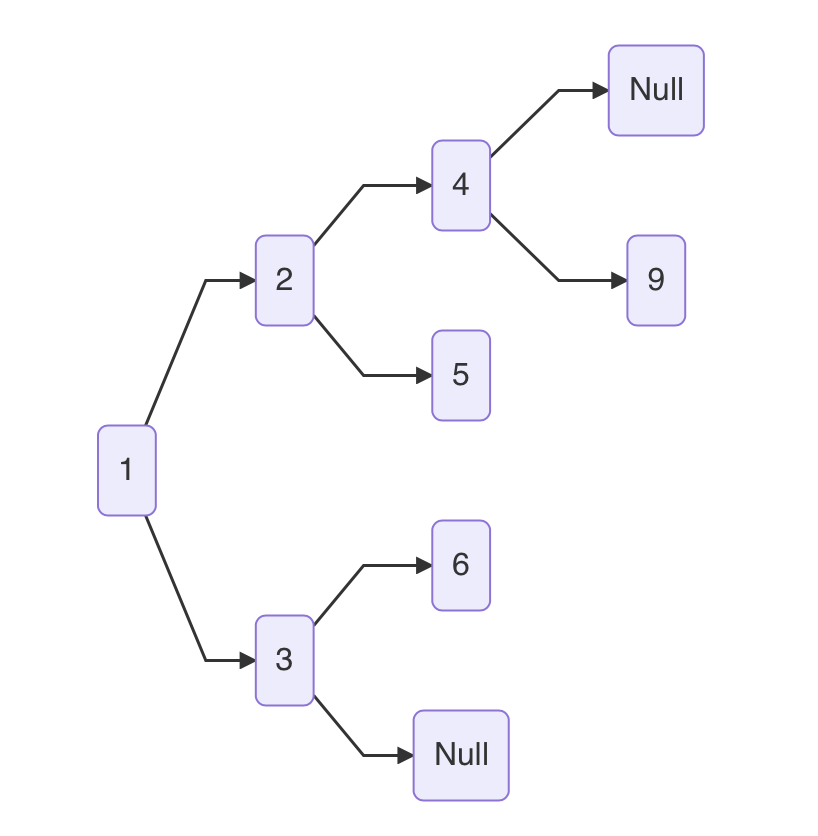
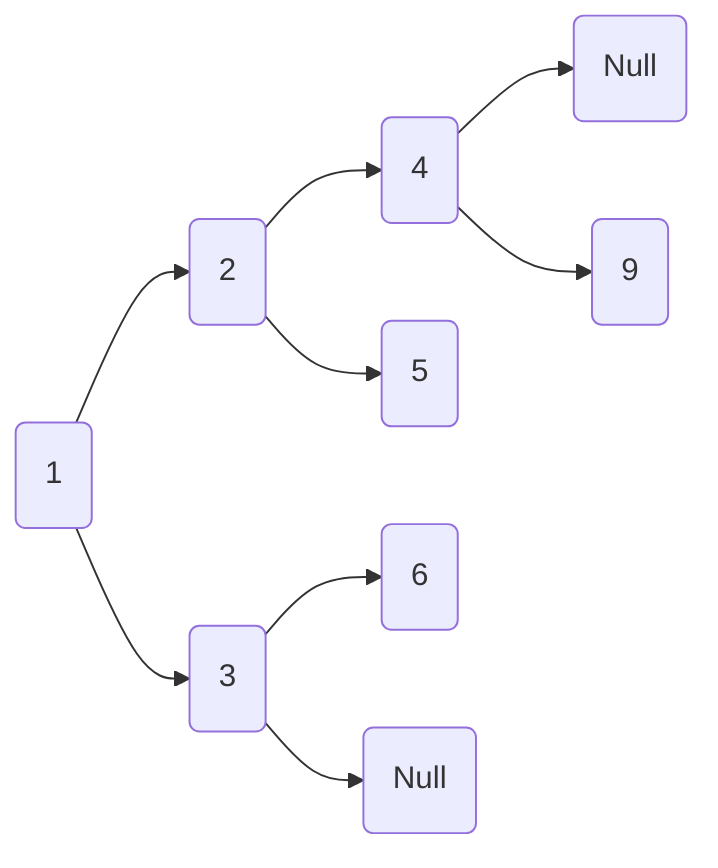

[[TOC]]
[TOC]

## 概述

### 评定标准

- 时间复杂度和空间复杂度的取舍，多数情况下，时间复杂度更重要，比如数据库缓存，就是空间换时间

#### 时间复杂度

- 常数、对数、线性、指数

#### 空间复杂度

- 常量、线性、二维空间、递归空间

### 分类

物理结构(存储结构)

- 顺序存储结构-数组
- 链式存储结构-链表

逻辑结构

- 线性结构
  - 顺序表、栈、队列
- 非线性结构
  - 图、树(二叉树、N叉树) (小知识，逻辑结构一般都可以用物理结构中的数组或者链表实现)

衍生结构(非书上分类)

- 跳跃链表
- 哈希链表 (缓存淘汰算法LRU)
- 位图

### 物理结构对比

- 基于以下两种数据结构，来看一下B+树
  - 非叶子节点，向下层查找数据，属于随机访问，层数不变过高，要稳定读盘次数
  - 叶子节点，一块比较大的数据上，属于顺序读取
  - 叶子节点，多块数据之间，由指针指向磁盘位置，属于随机读取(寻址)
  - 总体上，叶子节点属于顺序读取(或者批量读取)
- 特点对比

| 结构 | 物理结构 | 查找 | 更新 | 插入 | 删除 | 优点           | 缺点                         |
| ---- | -------- | ---- | ---- | ---- | ---- | -------------- | ---------------------------- |
| 数组 | 顺序存储 | O(1) | O(1) | O(n) | O(n) | 随机访问高效   | 插入删除要移动数据，影响效率 |
| 链表 | 随机存储 | O(n) | O(1) | O(1) | O(1) | 灵活插入和删除 | 查找数据麻烦                 |

- 特点对比续

| 结构 | 特点                        | 适合场景                          | 直接应用                | 相关算法          |
| ---- | --------------------------- | --------------------------------- | ----------------------- | ----------------- |
| 数组 | 顺序存储 只记录首地址和长度 | 读多写少                          | 语言的string与[]byte    | 二分查找 O log(n) |
| 链表 | 不考虑扩容，利用零碎内存    | 写多读少</br>双端读写，低深度访问 | redis的list go的channel |                   |

## 物理结构

### 数组

#### 数组结构

- 结构示例 位 bit
  - 申请四个字节，来存储MQTT，比如golang的[]byte


| 内存地址\位索引 | 十进制 | 十六进制 | 代表字符 | 7    | 6    | 5    | 4    | 3    | 2    | 1    | 0    |
| --------------- | ------ | -------- | -------- | ---- | ---- | ---- | ---- | ---- | ---- | ---- | ---- |
| ox 01           | 77     | 4d       | M        | 0    | 1    | 0    | 0    | 1    | 1    | 0    | 1    |
| ox 02           | 81     | 51       | Q        | 0    | 1    | 0    | 1    | 0    | 0    | 0    | 1    |
| ox 03           | 84     | 54       | T        | 0    | 1    | 0    | 1    | 0    | 1    | 0    | 0    |
| ox 04           | 84     | 54       | T        | 0    | 1    | 0    | 1    | 0    | 1    | 0    | 0    |

- 结构示例 字节 byte
  - MQTT，占用四个字节，中国你好，占用8个字节，比如golang的string，底层本质上还是字节数组


| 内存     | ox00 | 1    | 2    | 3    | 4    | 5    | 6    | 7    | ox08 | 1    | 2    | 3    | 4    | 5    | 6    | 7    |
| -------- | ---- | ---- | ---- | ---- | ---- | ---- | ---- | ---- | ---- | ---- | ---- | ---- | ---- | ---- | ---- | ---- |
| 数组索引 | 0    | 1    | 2    | 3    |      |      |      |      | 0    |      | 1    |      | 2    |      | 3    |      |
| 存储值   | M    | Q    | T    | T    | 空   | 闲   | 内   | 存   | 中   |      | 国   |      | 你   |      | 好   |      |

#### 数组特征

- 数据连续 在物理上<font color="red">顺序存储</font>
- 可以通过索引访问
- 数组有固定长度，如果扩容，则需要重新申请内存，并将数据复制过去

#### 数组增删改查

| 操作        | 说明                                                         | 复杂度 |
| ----------- | ------------------------------------------------------------ | ------ |
| 读          | 可以通过索引读取，俗称<font color="red">随机读取</font>      | 1      |
| 更          | 可以通过索引直接更新                                         | 1      |
| 插入 尾部   | 最简单，直接将元素插入到最尾部的空闲位置                     | 1      |
| 插入 中间   | 先挪移，再插入                                               | n      |
| 插入 超范围 | 先扩容，再插入，扩容=申请内存+复制旧数据</br>小容量采取翻倍扩容，大容量可以1.25倍扩容(golang的切片) | n      |
| 删          | 与插入相反                                                   | n      |

### 链表

#### 链表结构

- 用链表表示数据

| 内存地址 | ox00 | 1    | 2    | 3    | 4    | 5    | 6    | 7    | ox08 | 1    | 2    | 3    | 4    | 5    | 6    | 7    |
| -------- | ---- | ---- | ---- | ---- | ---- | ---- | ---- | ---- | ---- | ---- | ---- | ---- | ---- | ---- | ---- | ---- |
| 存储值   | ox08 | ox24 |      |      |      |      |      |      | NULL | 你   |      | 好   |      |      |      |      |
| 内存地址 | ox16 | 1    | 2    | 3    | 4    | 5    | 6    | 7    | ox24 | 1    | 2    | 3    | 4    | 5    | 6    | 7    |
| 存储值   |      |      |      |      |      |      |      |      | M    | Q    | T    | T    |      |      |      |      |

- 用代码表示

```go
type Node struct{
  Next *Node  // 指针在数据上面，对应内存里，推测指针应该在前面
	Data string
}

func New(){
  head := new(Node)  // 得到地址0x00
  First := new(Node) // 得到地址0x08
 	head.Next = First  // 将0x08记录到内存中

  head.Data = "MQTT" // 为节点赋值，注意，1-7的地址可能不够，所以这里记录的可能是指针0x24
  First.Data = "你好" // 如果空间够，直接记录值，个人更倾向于认为记录指针
}
```

#### 链表特征

- 数据不连续 在物理上<font color="red">随机存储</font>
- 只能通过指针依次访问，不能通过索引访问
- 可以无限扩容

#### 链表分类

| 分类         | 场景                            |
| ------------ | ------------------------------- |
| 单向链表     |                                 |
| 双向链表     |                                 |
| 单项循环链表 |                                 |
| 双向循环链表 | mysql的redo_log golang的channel |

#### 链表增删改查

没有固定长度，不需要考虑超范围插入

| 操作      | 说明                                                         | 复杂度 |
| --------- | ------------------------------------------------------------ | ------ |
| 读        | 查找数据，只能从头节点依次向后查，<font color="red">只能顺序读取</font> | n      |
| 更        | 先查找，后更新，查找O(n)，更新O(1)                           | 1      |
| 插入 尾部 | 尾部指针，指向数据                                           | 1      |
| 插入 头部 | 新数据指向第一个节点，head指向新数据                         | 1      |
| 插入 中间 | 新数据指向下一个节点，上一个节点指向新数据，可能需要查找的O(n) | 1      |
| 删        | 插入的反操作                                                 | 1      |

## 逻辑结构

### 栈和队列

| 结构     | 特点     | 操作      | 数组实现               | 链表实现 | 应用                              |
| -------- | -------- | --------- | ---------------------- | -------- | --------------------------------- |
| 栈       | 后进先出 | 入栈 出栈 | 操作数组的尾部         | 顶部指针 | 函数递归 golang的defer 面包屑导航 |
| 队列     | 先进先出 | 入队 出队 | 循环数组，避免移动数据 | 头尾指针 | 锁的等待队列                      |
| 双端队列 | 双端操作 |           |                        |          | redis的list                       |
| 优先队列 |          |           | x                      | x        | 不属于线性结构，而是二叉堆结构    |

### 散列表 哈希表

- 散列表主要提供的是一种映射关系
- 查找时间复杂度趋近于O(1)
- 物理结构是数组O(1)，而非链表O(n)，不同的地方是，数组和删除时，一般需要移动数据，而散列用的数组，允许空数据

- hash表，需要一个hash函数将key转化为索引，然后存储在数组中

#### 散列表操作

- 增
  - 先进行hash计算，然后对索引位进行写入操作，如果两个key计算的hash值相同，则产生碰撞
  - hash冲突
    - 开放寻址法（寻找下一个存储位置）
    - 链表法（数组和链表结合）
  - hash扩容与缩容
    - 扩容条件
      - 当前长度
      - 负载因子 java 0.75 redis 1 golang 6.5
    - 扩容机制
      - 翻倍扩容（一般情况下，hash的饱和度0.5情况下比较好，低时浪费空间，高时下挂比较多）
      - 渐进式rehash（重hash时，增是写新表，删，改，查都是对两张表进行操作）
- 删 改 查
  - 本质也是先进行hash计算，然后对索引位进行操作
  - 删除操作可能触发缩容机制

### 树和二叉树

- 线性结构 食堂打饭的排队队列
- 非线性结构 树 比如家谱关系 比如书的目录

#### 树的基本知识

- 空树 子树
- 树高
- 根节点 非叶子节点 叶子节点
- 父节点 孩子节点

#### 二叉树

- 左孩子 右孩子

##### 满二叉树和完全二叉树

- 满二叉树，假如树高4层，第3层的所有节点，都有2个孩子
  - 所有非叶子都有2孩子
  - 所有叶子在同一层级
- 完全二叉树，假如树高4层，第3层是满二叉树，第4层最少1个叶子
  - 叶子节点必须是从左向右（和满二叉树对应）

##### 二叉树的存储

- 二叉树属于逻辑结构
- 物理结构可以使用链表，也可以使用数组存储

###### 直观的链表存储

```go
type Node struct{
  LNode *Node
  RNode *Node
  Data  interface{}
}
```

###### 方便定位数组存储

- 树结构，缺失3(7)，4(8)

  



- 二叉树在数组上的存储
  - 颜色变化，表示树高变化
  - 对应节点如果没有数据，数组留空跳过即可，这样方便定位，但是有一定的空间浪费
    - 稀疏的二叉树，使用数组是非常浪费空间
    - 稠密的二叉树(完全或者满二叉树)，使用数组，就不浪费空间了
  - 定位公式
    - 左节点 patient*2+1
    - 右节点 patient*2+2
    - 父节点 (leftChild-1)/2 或者(rightChild-2)/2

| 索引 | 0                          | 1                           | 2                           | 3                          | 4                          | 5                          | 6                             | 7                              | 8                           |
| ---- | -------------------------- | --------------------------- | --------------------------- | -------------------------- | -------------------------- | -------------------------- | ----------------------------- | ------------------------------ | --------------------------- |
| 数据 | <font color="red">1</font> | <font color="blue">2</font> | <font color="blue">3</font> | <font color="red">4</font> | <font color="red">5</font> | <font color="red">6</font> | <font color="red">Null</font> | <font color="blue">Null</font> | <font color="blue">9</font> |

##### 二叉树应用

- 查找操作
- 维持相对顺序

| 结构                   | 结构描述                                                     | 缺点                       | 作用             | 时间复杂度 |
| ---------------------- | ------------------------------------------------------------ | -------------------------- | ---------------- | ---------- |
| 二叉查找树(排序树)     | 左节点值小于父节点，右节点值大于父节点</br>由上面可知，二叉查找树创建的时候就是有序的 | 可能退化成链表，需要自平衡 | 查找，类似二分法 | O log n    |
| 自平衡 AVL(平衡二叉树) |                                                              |                            |                  |            |
| 自平衡 红黑树          |                                                              |                            |                  |            |
| 二叉堆                 |                                                              |                            |                  |            |

##### 二叉树遍历

- 数组和链表的遍历，遍历本身是线性操作，所以遍历数组和链表时，从第一个元素向后读，非常契合
- 二叉树的遍历
  - 广度优先遍历 层次遍历 需要借助队列来实现
  - 深度优先遍历 (先 中 后 指的是根节点的遍历顺序) 需要借助递归或者栈来实现
    - 先序遍历 根节点 左子树 右子树
    - 中序遍历 左子树 根节点 右子树
    - 后序遍历 左子树 右子树 根节点
